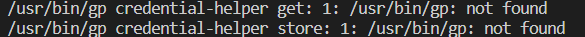
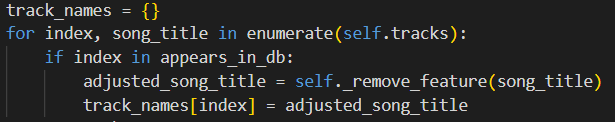
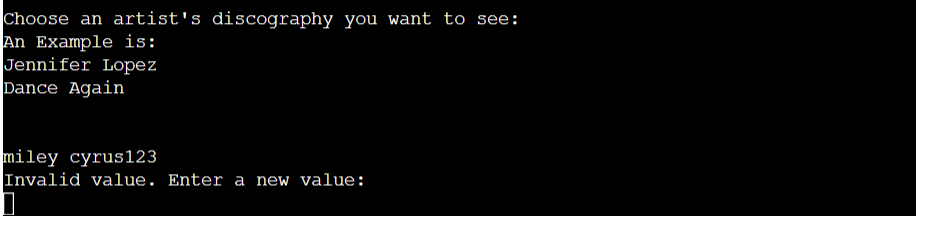
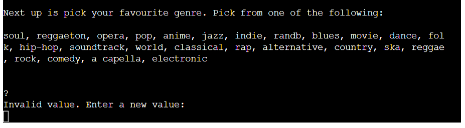
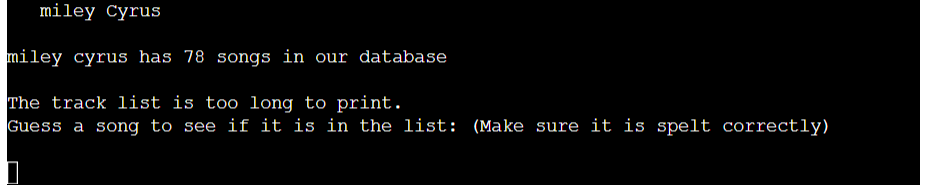
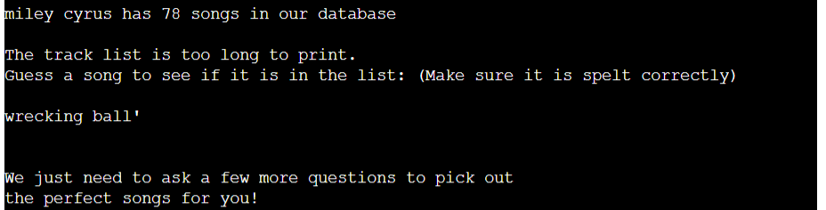
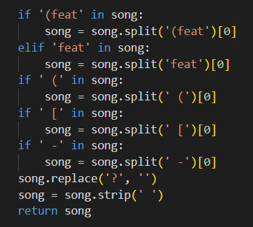
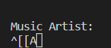
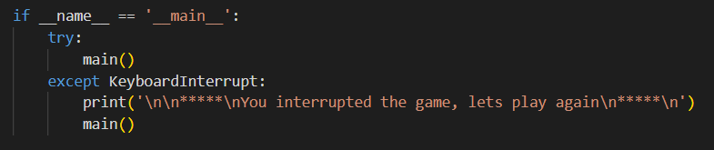
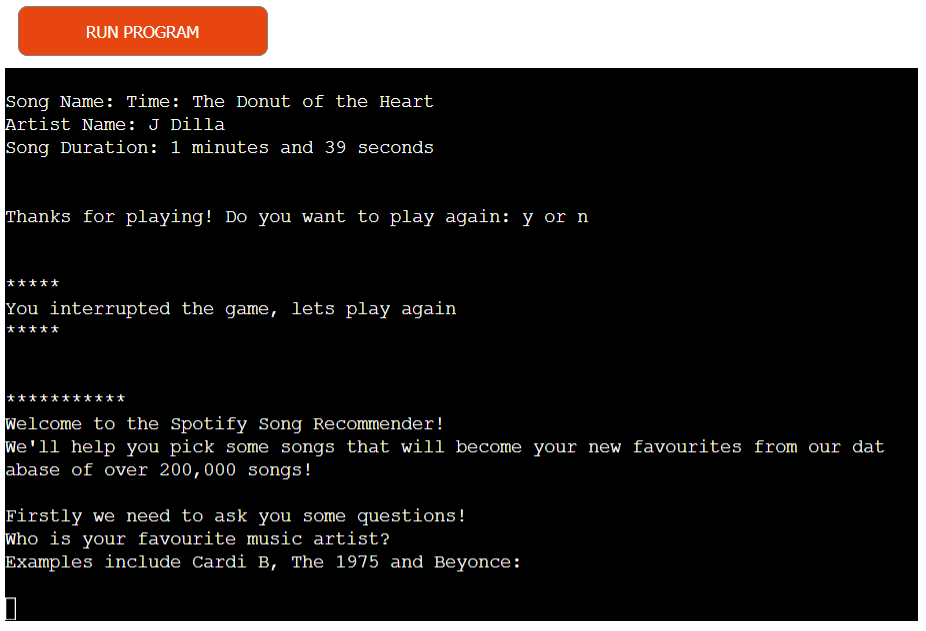

# Spotify Song Recommendations

# Introduction

# Aim of the Application
Welcome to a website dedicated to providing song recommendations for the user using a dataset consisting of Spotify song data. The aim is to provide the user with up to 20 song suggestions based on answers given to the questions asked and then to print them onto a Google Sheet so they can access the song details independently from the Terminal interface.

[Visit the Website Here](https://spotify-db-recommendations.herokuapp.com/)

[Visit the Project's GitHub Repository Here]( https://github.com/Grawnya/spotify-song-recommendations)

# How to Use
The user can interact with the application by going into the website and answering the questions on the screen. The user will be asked for:
* Their favourite music artist
* Their favourite genre from a list provided
* The music artist who sings their favourite track or song
* The title of their favourite track
* If they feel like dancing?
* If they want to focus?
* If they want to listen to something popular?

These questions will enable the programme to pick up to 20 songs, returning them one by one in the form of:

Song Name
Artist Name
Duration

The user will be asked to play again, restarting the game if they opt to play again. Otherwise, if they don’t want to play again, a link to the most recent recommendations on a Google Sheet is printed out onto the terminal.

# Table of Contents

* [UX](#ux "UX")
    * [User Goals](#user-goals "User Goals")
    * [User Stories](#user-stories "User Stories")
    * [User Requirements and Expectations](#user-requirements-and-expectations)
         * [Requirements](#requirements)
         * [Expectations](#expectations)
* [Initial Planning](#initial-planning "Initial Planning")
* [Features](#features "Features")
    * [Existing Features](#existing-features "Existing Features")
         * [Start Application Screen](#start-application-screen "Start Application Screen")
         * [Choose Favourite Genre](#choose-favourite-genre "Choose Favourite Genre")
         * [Choose Favourite Track](#choose-favourite-track "Choose Favourite Track")
         * [Choose Moods](#choose-moods "Choose Moods")
         * [Print Song Values](#print-song-values "Print Song Values")
         * [Play Again](#play-again "Play Again")
    * [Features to be Implemented](#features-to-be-implemented "Features to be Implemented")
* [Technologies Used](#technologies-used "Technologies Used")
    * [Languages](#languages "Languages")
    * [Python Libraries and Technologies](#python-libraries-and-technologies "Python Libraries and Technologies")	
    * [Tools](#tools "Tools")
* [Testing](#testing "Testing")
    * [Code Validation](#code-validation "Code Validation")
        * [PEP8 Linter](#pep8-linter "PEP8 Linter")
            * [First Attempt](#first-attempt "First Attempt")
            * [Final Attempt](#final-attempt "Final Attempt")
    * [Manual Testing](#manual-testing "Manual Testing")	
    * [Testing User Stories](#testing-user-stories "Testing User Stories")
* [Bugs](#bugs "Bugs")
    * [Resolved](#resolved "Resolved")
        * [API Credentials for Google Drive not Working](#api-credentials-for-google-drive-not-working "API Credentials for Google Drive not Working")
        * [Only Logging First Index of Favourite Artist's Songs when Looping through Entire List of Music Artists in the Spotify Dataset](#only-logging-first-index-of-favourite-artists-songs-when-looping-through-entire-list-of-music-artists-in-the-spotify-dataset "Only Logging First Index of Favourite Artist's Songs when Looping through Entire List of Music Artists in the Spotify Dataset")
        * [If Symbols or Whitespace are not Removed, it will cause an Error](#if-symbols-or-whitespace-are-not-removed-it-will-cause-an-error "If Symbols or Whitespace are not Removed, it will cause an Error")
        * [Artists Featured in a Song or Extra Details in title cause an `invalid value` error](#artists-featured-in-a-song-or-extra-details-in-title-cause-an-invalid-value-error "Artists Featured in a Song or Extra Details in title cause an `invalid value` error")
	    * [Arrow Keys cause an Error in Values](#arrow-keys-cause-an-error-in-values "Arrow Keys cause an Error in Values")
	    * [The Recommendations Dataframe is Empty](#the-recommendations-dataframe-is-empty "The Recommendations Dataframe is Empty")
	    * [Long URL causing error in PEP8 Linter](#long-url-causing-error-in-pep8-linter "Long URL causing error in PEP8 Linter")
	    * [`KeyboardInterrupt` Value Obtained when `ctrl` + `C` in the Application](#keyboardInterrupt-value-obtained-when-ctrl-+-C-in-the-application "`KeyboardInterrupt` Value Obtained when `ctrl` + `C` in the Application")
    * [Unresolved](#unresolved "Unresolved")
* [Deployment](#deployment "Deployment")
* [Credits](#credits "Credits")
    * [For Code Help and Advice](#for-code-help-and-advice "For Code Help and Advice")
    * [For Content](#for-content "For Content")
    * [For Code](#for-code "For Code")

# UX

## User Goals
* Provide song recommendations based on existing taste
* Questions asked to grasp an accurate sense of mood and taste
* Logical flow to the game so no confusion about what to do next at any point
* Answer questions with minimal errors i.e. constant invalid artist names or misspelling.
* Ability to review recommendations when the game is finished so the user can log them elsewhere or put them into their own Spotify playlists.

## User Stories
* As a user, I want to get song recommendations from the application based on songs and artists I like.
* As a user, I want to answer questions that will accurately predict songs that I will like.
* As a user, I want to easily use the application and not get confused at any stage of what to do next.
* As a user, I don’t want to constantly input answers to the questions if they are invalid, as the application might be too difficult to use and I could become bored with it.
* As a user, when the game is finished, I want to see my song recommendations in one place so I can add them to an existing playlist or create a new one.

## User Requirements and Expectations
### Requirements
* Easy to navigate or use the application, to prevent confusion.
* Present introductory sentences in basic English to make the application more accessible.
* Let the user know if the artist, genre or track value entered into the terminal exists in the dataset.
* Entice the user to play again due to the excitement associated with getting new track recommendations.

### Expectations
* I expect the application to flow nicely with a clear, logical progression of the application.
* I expect the website to be completely responsive to all inputs, whether they are values in the dataset or answers to closed yes or no questions.
* I anticipate that the user might want to play again and will build that functionality into the application.

\
&nbsp;
[Back to Top](#table-of-contents)
\
&nbsp;

# Initial Planning
In order to efficiently start creating the application, a basic flow diagram was created. It was used to dictate the flow of the application and to build the functionality as quickly as possible into the programme:

As the application began to take a shape, a more in-depth flow chart was created and can be found via the link below:

[Final Flow Chart](documentation/song_recommendations.pdf "Final Flow Chart")

\
&nbsp;
[Back to Top](#table-of-contents)
\
&nbsp;

# Features

## Existing Features
### Start Application Screen
The application starts by welcoming the user and letting them know that there is an extensive database of songs that the programme can select from, which will effectively make suggested recommendations. It tells the user that in order to make recommendations, they must answer some questions.

The first questions asks the user to enter the name of their favourite artist, while providing some examples to get them started, as seen below.

\
&nbsp;

### Choose Favourite Genre
If the user has successfully entered in an artist’s name, who appears in the Spotify dataset, they will move onto the next question, where the user will be asked for the favourite genre of music. A list of valid genre values will be printed on the terminal to aid the user in picking one.

\
&nbsp;

### Choose Favourite Track
If the user has successfully entered in a genre, which appears in the Spotify dataset, they will move onto the favourite track section. Firstly, they will type in the artist name who sings their favourite song. This is done to narrow the number of rows that the programme must go through when searching song names and eliminates the confusion of selecting songs with the same title that are completely different:

If the track artist exists, the programme will do 1 of 2 things. If the artist has very few tracks in the dataset i.e. 10 or less, then it will print them onto the terminal:

If there are too many songs in the artist’s discography, it just prompts the user to guess:

\
&nbsp;

### Choose Moods
In order to get an indication of what the user might want to listen to, the script will ask the user a few questions about how they are currently feeling, providing that the track entered was valid.

The mood questions are closed answer questions also known as yes/no questions. Therefore, a variation of yes or no answers will be question. This will be discussed later on in the [Manual Testing](#manual-testing "Manual Testing") section. 

Providing the user inputs a valid answer, the user is then asked if they want to focus to determine if they want to listen to a song with few words i.e. very instrumental. Following that, the user is asked if they want to listen to a popular song or one that is more niche/not as commonly listened to. This establishes if they want to potentially discover a new artist or if main stream media influences their music choice:

\
&nbsp;

### Print Song Values
If a track is found, the script uses all the inputted collate a small dataset of 20 recommended songs for the user. In order to not overwhelm the user with the entire dataset dumped in the terminal one screen. 

It prints each recommended song one by one, so the user can document the song’s details and if they want another recommendation, they can let the script know to print the next song details on the terminal by answering “y” or “n”.

\
&nbsp;

### Play Again
If the user opts not to get another song recommendation, they will be asked if they want to restart the application. If they choose to restart the application, it starts from the very start again and makes brand new recommendations, which are not influenced by the previous recommendations.

If the user does not want to play the game again, they can say “n” and the application will provide a link for the user to access a Google Sheet with all the recommended song details. Due to the sensitivity of pressing `ctrl` + `C`, which will cause a `keyboardInterrupt` error in the application, an instruction to highlight the link, right click and select “copy” has been provided. This will allow the user to open a new tab and safely enter the link to the Google sheet.

An additional thank you for playing message is included along with a link to the application programmer’s LinkedIn account if the user wanted to reach out to provide feedback.

\
&nbsp;

## Features to be Implemented
* Refine the process by storing the song recommendation data and asking the users some questions about themselves, so data analytics can be used to determine what songs are most popular amongst a certain demographic.
* Ask the user if they were happy or not with the recommendation. Could use Machine Learning to produce more effective recommendations.
* Build on the project with the Spotify API, as it has more functions and a greater database of all possible songs on their platform, whereas there’s only just over 200,000 in the dataset used for this application.

\
&nbsp;
[Back to Top](#table-of-contents)
\
&nbsp;

# Technologies Used
## Languages
* [Python]( https://en.wikipedia.org/wiki/Python_(programming_language) "Python")

## Python Libraries and Technologies
* [gspread](https://docs.gspread.org/en/v5.4.0/ "gspread")
* [readline](https://docs.python.org/3/library/readline.html "readline")
* [operator](https://docs.python.org/3/library/operator.html "operator")
* [pandas](https://pandas.pydata.org/ "pandas")
* [string](https://docs.python.org/3/library/string.html "string")
* [Google Drive API](https://developers.google.com/drive/api/quickstart/python "Google Drive API")
* [Google Sheets](https://en.wikipedia.org/wiki/Google_Sheets "Google Sheets")

## Tools
* [Gitpod](https://www.gitpod.io/ "Gitpod")
* [GitHub](https://github.com/ "GitHub")
* [PEP8 Linter](http://pep8online.com/ "PEP8 Linter")

\
&nbsp;
[Back to Top](#table-of-contents)
\
&nbsp;

# Testing

## Code Validation 
### PEP8 Online Linter
The supporting Python document with Spotify class information `spotify.py` was often run through a [PEP8 linter](http://pep8online.com/ "PEP8 Linter") to check for any syntax or declaration errors. Below contains the returned results of the script.

#### First Attempt
Many warning and errors were obtained in the first run through the PEP8 linter. These can be found [here](documentation/pep8_linter). They mainly consisted of lines that were too long, over-indentation or under-indentation of items and then too many or too few blank lines. 

#### Final Attempt
No issues arose in both `spotify.py` and `run.py`

\
&nbsp;

## Manual Testing
A pivotal part of programming to ensure an application runs smoothly, manual testing took up a large part of time dedicated to the project. Due to errors and bugs found while manually testing, this section will overlap quite heavily with [Bugs](#bugs "Bugs"):

* None “yes” or “no” Inputs:
	* Verified that the user can’t input arrow keys for values.
	* Verified that the user can enter a value with or without an apostrophe and/or a full stop.
	* Verified that the user can’t enter a blank string.
	* Verified that the user can enter a value that typically has “é” and use “e” instead. Appears to be most common symbol found in popular artists e.g. a user can input “beyonce” and songs for the singer “Beyoncé” will appear.
	* Verified that if a user has whitespace at the start or trailing after they have entered a word, it will strip the input of it and not throw up an error.
	* Verified that regardless of the input’s case i.e. lowercase, uppercase or a mix of both, the value will still be read in and found in the Spotify dataset in the accurate column.

* “yes” or “no” Inputs:
	* Verified that the user can input a space in the word or alongside it and it will still read in the input if accurate.
	* Verified that the user can enter “yes” or “no” instead of “y” or “n”.
	* Verified that the user can input “y” or “n” regardless of case.

* Start Application Screen/Choose Favourite Artist:
	* Verified that the user can input a name into the terminal and if it exists, the script will move onto the next section.
	* Verified that if the user spells the name of the artist incorrectly or if the artist is not in the Spotify dataset, then an `Invalid Value` error will appear and prompt the user to input a new value.

* Choose Favourite Genre:
	* Verified that the user can input a genre into the terminal and if it exists, the script will move onto the next section.
	* Verified that if the user spells the name of the genre incorrectly or if the genre is not in the printed list of genres, then an `Invalid Value` error will appear and prompt the user to input a new value.

* Choose Favourite Track:
	* Verified that the user can input the artist name of their favourite song into the terminal and if it exists, the script will move onto the song section.
	* Verified that if the user spells the name of the artist incorrectly or if the artist is not in the Spotify dataset, then an `Invalid Value` error will appear and prompt the user to input a new value.
	* Verified that the user can input their favourite song into the terminal and if it exists, the script will move onto the song section.

* Choose Mood Values:
	* Verified that the rules for the closed questions are adopted here.

* Play Again:
	* Verified that the rules for the closed questions are adopted here.
	* Verified that if the user wants to play again, the game starts from the start.
	* Verified that if the user doesn’t want to play again i.e. end the game, a valid Google Sheet link will output onto the terminal and the user will be thanked for playing.
	* Verified that at the end of the game, the user can find a link to contact the application programmer if they have any feedback or questions.
\
&nbsp;

## Testing User Stories 
1. As a user, I want to get song recommendations from the application based on songs and artists I like.
	* If the user engages with the questions asked, they’ll get an output of up to 20 questions which have been selected based on the user’s favourite artist, genre, song and how they’re currently feeling.

2. As a user, I want to answer questions that will accurately predict songs that I will like.
	* From the start of the application, the user is constantly asked questions in order to gauge what their musical taste is and what they want to listen to based on their current mood.

3. As a user, I want to easily use the application and not get confused at any stage of what to do next.
	* This is vital to keep the user interested in the game. Therefore the game adopts a logical flow where a user can only conduct one task at a time.

4. As a user, I don’t want to constantly input answers to the questions if they are invalid, as the application might be too difficult to use and I could become bored with it.
	* The [manual testing](#manual-testing "Manual Testing") conducted was deliberately focused on simplifying both the artist and track names to ensure that if the user had the correct name and spelling, that the value would be found, regardless of whitespace, grammatical signs or pressing of an arrow key.

5. As a user, when the game is finished, I want to see my song recommendations in one place so I can add them to an existing playlist or create a new one.
	* A Google sheet was deliberately used to allow the user to document their final set of song recommendations. It allows the user to see the qualities of the songs they have been recommended and gives them time to write them down or add them to a playlist.

\
&nbsp;
[Back to Top](#table-of-contents)
\
&nbsp;

# Bugs

## Resolved
### API Credentials for Google Drive not Working
**Problem:**
The script was not running on the deployed website and was logging an error in the terminal that the credentials couldn’t be found.

**Cause:**
The Google Drive API credentials couldn’t be found in the repository.

**Resolution:**
By getting new credentials and a new API key, the new json formatted details replaced the old credentials and the script began to work again.

### Only Logging First Index of Favourite Artist’s Songs when Looping through Entire List of Music Artists in the Spotify Dataset
**Problem:**
When trying to get the indices of every song that the user’s favourite singer has sung, only the first index appears.

**Cause:**
Even though the script goes through every row in the dataframe, if calling the index of where the singer appears in a column, it always returns the first value.

**Resolution:** 
Using an `enumerate` statement the matching key-value pair of index: song title were added to a dictionary to ensure that each index had a unique song title value.

**Fix:**
\
&nbsp;

### If Symbols or Whitespace are not Removed, it will cause an Error
**Problem:**
If an artist is not in the dataset, it will flag an error, as seen in the first image below.

**Cause:**
This is due to the values in the dataset looking for he identical matching string – no leeway with spelling or character inputs.

**Resolution:**
Format the entire dataset values and the inputs from the user, as seen in the [Manual Testing](#manual-testing "Manual Testing") section, which allow for the following.

**Fix:**
\
&nbsp;
**Picks Up Genuine Error If Not a Value in a List**

**Ignores Trailing Whitespace**

**Ignores Apostrophes**

### Artists Featured in a Song or Extra Details in title cause an `invalid value` error
**Problem:**
Even though the main part of the song matches what the user has put in, if it is a niche remix, contains extra song details in the song title e.g. “She Wolf (Falling to Pieces) [feat. Sia]

**Cause:**
The official song title might be slightly different than the commonly known one, as not everyone knows the long series of featured artists in a song.

**Resolution:**
Create a function that rids all common symbols from a song.

**Fix:**
\
&nbsp;

### Arrow Keys cause an Error in Values
**Problem:**
Every time the user presses an arrow key, up appears a `^` followed by 2 square brackets and a letter corresponding to the direction of the arrow key.

**Cause:**
No library or technology is used to block the use of arrow key values in the terminal.

**Resolution:**
Import the `readline` library, which doesn’t allow keys that are not one of the following numerical, alphabetical, symbolic or certain keys like `return` or `space`.

### The Recommendations Dataframe is Empty	
**Problem:**
If the user’s taste is too niche i.e. very few related sings to their genre, favourite artist, favourite song and all 3 mood values, there is potential for an empty dataset to be returned.

**Cause:**
The user’s niche music taste.

**Resolution:**
Set the recommendations dataset to that equal to the one before the mood values influenced the dataframe. It cannot be equal since it is a dataset of all the favourite artist’s songs, related songs to the user’s favourite song and all the songs of their favourite genre.

### Long URL causing error in PEP8 Linter	
**Problem:**
When checking if the programming scripts align with PEP8, the code validation section fails on the long link line.

**Cause:**
The line is longer than the 79 characters that PEP8 typically allows.

**Resolution:**
PEP8 claims that the user can ignore the rule in special circumstances e.g. not to break up a link and can use `# noqa` at the end of the line.

### `KeyboardInterrupt` Value Obtained when `ctrl` + `C` in the Application
**Problem:**
Every time the user presses `ctrl` + `C`, the application automatically stops, which isn’t useful if the user tries to copy the Google Sheet link without following the provided instructions.

**Cause:**
`ctrl` + `C` automatically stops the script from running.

**Resolution:**
Use a try/except element to catch the error and start the game again, as seen below.

**Fix:**
\
&nbsp;
**Catch KeyboardInterrupt Function**

**Catch KeyboardInterrupt in Application**

\
&nbsp;
[Back to Top](#table-of-contents)
\
&nbsp;

## Unresolved
None – but there was an initial attempt using the Spotify API. However it wouldn’t successfully run and therefore, close to the project deadline, I opted to use an alternative method to recommend songs.

\
&nbsp;
[Back to Top](#table-of-contents)
\
&nbsp;

# Deployment

During the process of coding up the website, the code was deployed on Heroku to allow for continuous manual testing and code validation. The following steps were conducted to deploy the website on Heroku:

1. Create a Heroku account if you don’t have one and login.
2. Create a new application, by selecting the “new” button on the top right of the dashboard and click “Create new app”.
3. Choose a unique name for the application and select the region you live in, followed by "Create App".
4. When the Project’s page opens up, go to the "settings" tab and scroll down to the “Config Vars” section. 
5. Enter the following key-valuen pairs in the “Config Vars” section: 
	* Key = PORT : Value = 8000
	* Key = CREDS : Value = contents of the Google Drive API json API key
6. Scroll down to the Buildpacks section and select "Add Buildpacks" – adding the Python Buildpack first and the Node.js open next. Make sure the Python buildpack is above the Node.js one.
7. Go to the “Deploy” tab next and scroll down to the GitHub deployment method.
8. Search for the suitable repository and then connect to it by selecting the “Connect” button.
9. Scroll down to the bottom of the “Deploy” Page and select the type of deployment you want to conduct. If you opt to “Automatically Deploy”, it will deploy every time you push new code to your repository. Otherwise, you will have to manually deploy, by selecting the button at the bottom of the page.
10. The application is now deployed!

\
&nbsp;
[Back to Top](#table-of-contents)
\
&nbsp;

# Credits

## For Code Help and Advice
* [Harry Dhillon](https://github.com/Harry-Leepz)
\
&nbsp;

## For Content
* [Kaggle Spotify Dataset]( https://www.kaggle.com/datasets/zaheenhamidani/ultimate-spotify-tracks-db)
* [To get range of values acceptable for each mood]( https://developer.spotify.com/documentation/web-api/reference/#/operations/get-recommendations)

## For Code
* [PEP8 Long Line Query](https://stackoverflow.com/questions/10739843/how-should-i-format-a-long-url-in-a-python-comment-and-still-be-pep8-compliant)
* [To select 20 random songs from a dataframe]( https://www.geeksforgeeks.org/how-to-randomly-select-rows-from-pandas-dataframe/)

\
&nbsp;
[Back to Top](#table-of-contents)
\
&nbsp;
