# Spotify Song Recommendations

# Introduction

# Aim of the Application
Welcome to a website dedicated to providing song recommendations for the user using a dataset consisting of Spotify song data. The aim is to provide the user with up to 20 song suggestions based on answers given to the questions asked and then to print them onto a Google Sheet so they can access the song details independently from the Terminal interface.

[Visit the Website Here](https://spotify-db-recommendations.herokuapp.com/)

[Visit the Project's GitHub Repository Here]( https://github.com/Grawnya/spotify-song-recommendations)

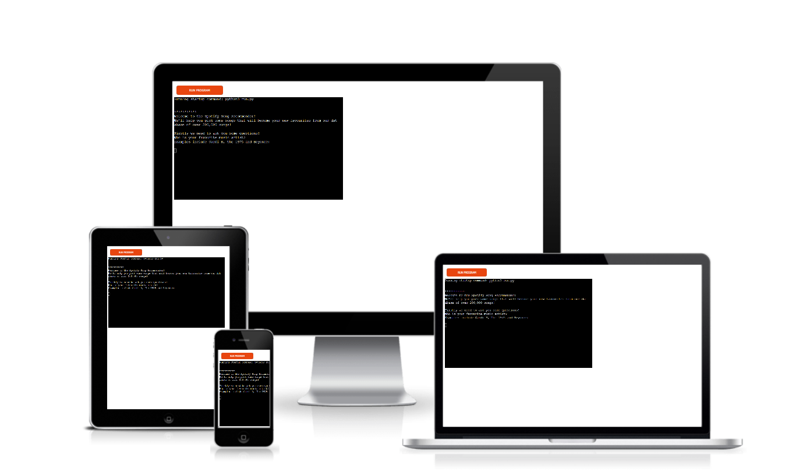

# How to Use
The user can interact with the application by going into the website and answering the questions on the screen. The user will be asked for:
* Their favourite music artist
* Their favourite genre from a list provided
* The music artist who sings their favourite track or song
* The title of their favourite track
* If they feel like dancing?
* If they want to focus?
* If they want to listen to something popular?

These questions will enable the programme to pick up to 20 songs, returning them one by one in the form of:

Song Name
Artist Name
Duration

The user will be asked to play again, restarting the game if they opt to play again. Otherwise, if they don’t want to play again, a link to the most recent recommendations on a Google Sheet is printed out onto the terminal.

# Table of Contents

* [UX](#ux "UX")
    * [User Goals](#user-goals "User Goals")
    * [User Stories](#user-stories "User Stories")
    * [User Requirements and Expectations](#user-requirements-and-expectations)
         * [Requirements](#requirements)
         * [Expectations](#expectations)
* [Initial Planning](#initial-planning "Initial Planning")
* [Features](#features "Features")
    * [Existing Features](#existing-features "Existing Features")
         * [Start Application Screen](#start-application-screen "Start Application Screen")
         * [Choose Favourite Genre](#choose-favourite-genre "Choose Favourite Genre")
         * [Choose Favourite Track](#choose-favourite-track "Choose Favourite Track")
         * [Choose Moods](#choose-moods "Choose Moods")
         * [Print Song Values](#print-song-values "Print Song Values")
         * [Play Again](#play-again "Play Again")
    * [Features to be Implemented](#features-to-be-implemented "Features to be Implemented")
* [Technologies Used](#technologies-used "Technologies Used")
    * [Languages](#languages "Languages")
    * [Python Libraries and Technologies](#python-libraries-and-technologies "Python Libraries and Technologies")	
    * [Tools](#tools "Tools")
* [Testing](#testing "Testing")
    * [Code Validation](#code-validation "Code Validation")
        * [PEP8 Linter](#pep8-linter "PEP8 Linter")
            * [First Attempt](#first-attempt "First Attempt")
            * [Final Attempt](#final-attempt "Final Attempt")

# UX

## User Goals
* Provide song recommendations based on existing taste
* Questions asked to grasp an accurate sense of mood and taste
* Logical flow to the game so no confusion about what to do next at any point
* Answer questions with minimal errors i.e. constant invalid artist names or misspelling.
* Ability to review recommendations when the game is finished so the user can log them elsewhere or put them into their own Spotify playlists.

## User Stories
* As a user, I want to get song recommendations from the application based on songs and artists I like.
* As a user, I want to answer questions that will accurately predict songs that I will like.
* As a user, I want to easily use the application and not get confused at any stage of what to do next.
* As a user, I don’t want to constantly input answers to the questions if they are invalid, as the application might be too difficult to use and I could become bored with it.
* As a user, when the game is finished, I want to see my song recommendations in one place so I can add them to an existing playlist or create a new one.

## User Requirements and Expectations
### Requirements
* Easy to navigate or use the application, to prevent confusion.
* Present introductory sentences in basic English to make the application more accessible.
* Let the user know if the artist, genre or track value entered into the terminal exists in the dataset.
* Entice the user to play again due to the excitement associated with getting new track recommendations.

### Expectations
* I expect the application to flow nicely with a clear, logical progression of the application.
* I expect the website to be completely responsive to all inputs, whether they are values in the dataset or answers to closed yes or no questions.
* I anticipate that the user might want to play again and will build that functionality into the application.

\
&nbsp;
[Back to Top](#table-of-contents)
\
&nbsp;

# Initial Planning
In order to efficiently start creating the application, a basic flow diagram was created. It was used to dictate the flow of the application and to build the functionality as quickly as possible into the programme:

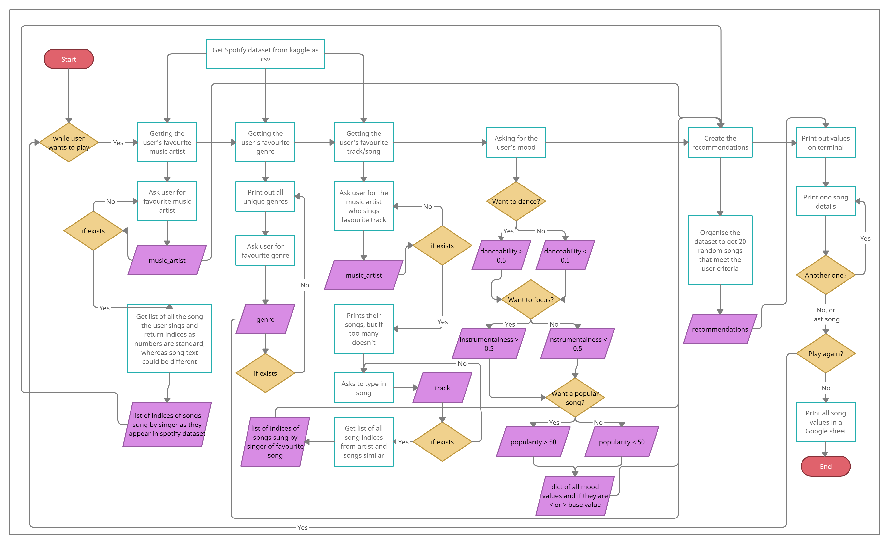

As the application began to take a shape, a more in-depth flow chart was created and can be found via the link below:

### [Final Flow Chart](documentation/song-recommendations.pdf "Final Flow Chart")

\
&nbsp;
[Back to Top](#table-of-contents)
\
&nbsp;

# Features

## Existing Features
### Start Application Screen
The application starts by welcoming the user and letting them know that there is an extensive database of songs that the programme can select from, which will effectively make suggested recommendations. It tells the user that in order to make recommendations, they must answer some questions.

The first questions asks the user to enter the name of their favourite artist, while providing some examples to get them started, as seen below.

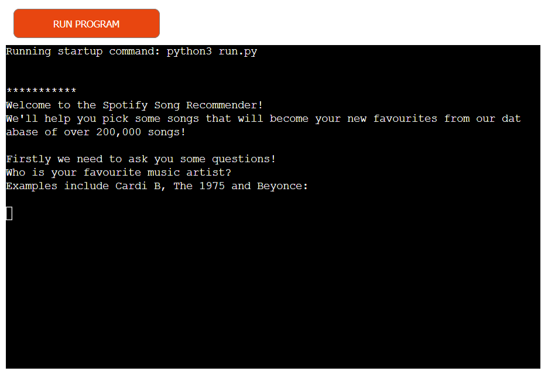
\
&nbsp;

### Choose Favourite Genre
If the user has successfully entered in an artist’s name, who appears in the Spotify dataset, they will move onto the next question, where the user will be asked for the favourite genre of music. A list of valid genre values will be printed on the terminal to aid the user in picking one.

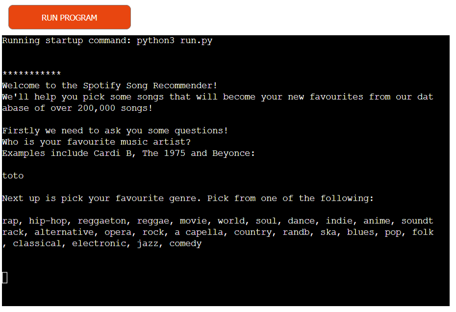
\
&nbsp;

### Choose Favourite Track
If the user has successfully entered in a genre, which appears in the Spotify dataset, they will move onto the favourite track section. Firstly, they will type in the artist name who sings their favourite song. This is done to narrow the number of rows that the programme must go through when searching song names and eliminates the confusion of selecting songs with the same title that are completely different:

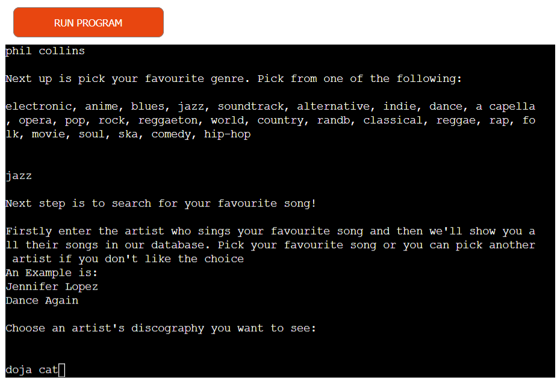

If the track artist exists, the programme will do 1 of 2 things. If the artist has very few tracks in the dataset i.e. 10 or less, then it will print them onto the terminal:

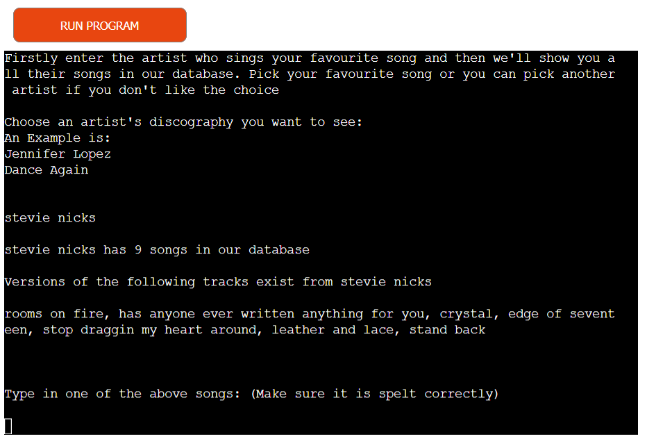

If there are too many songs in the artist’s discography, it just prompts the user to guess:

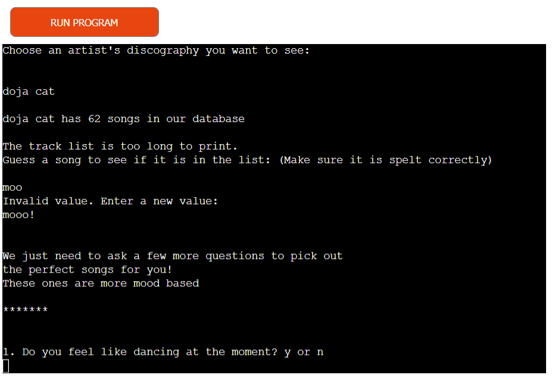
\
&nbsp;

### Choose Moods
In order to get an indication of what the user might want to listen to, the script will ask the user a few questions about how they are currently feeling, providing that the track entered was valid.

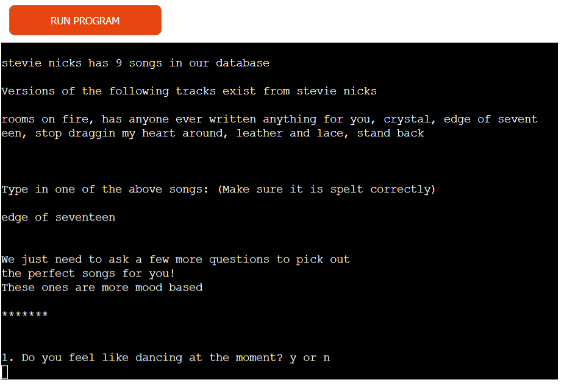

The mood questions are closed answer questions also known as yes/no questions. Therefore, a variation of yes or no answers will be question. This will be discussed later on in the [Manual Testing](#manual-testing "Manual Testing") section. 

Providing the user inputs a valid answer, the user is then asked if they want to focus to determine if they want to listen to a song with few words i.e. very instrumental. Following that, the user is asked if they want to listen to a popular song or one that is more niche/not as commonly listened to. This establishes if they want to potentially discover a new artist or if main stream media influences their music choice:

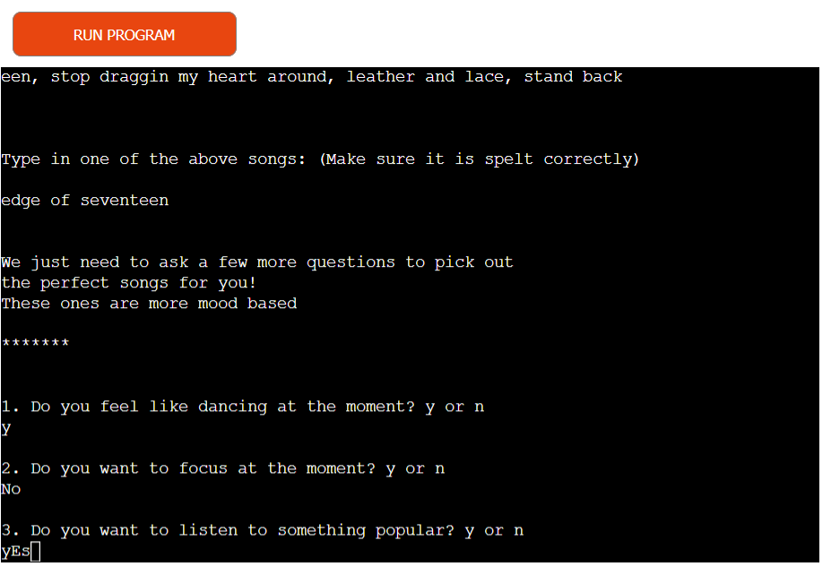
\
&nbsp;

### Print Song Values
If a track is found, the script uses all the inputted collate a small dataset of 20 recommended songs for the user. In order to not overwhelm the user with the entire dataset dumped in the terminal one screen. 

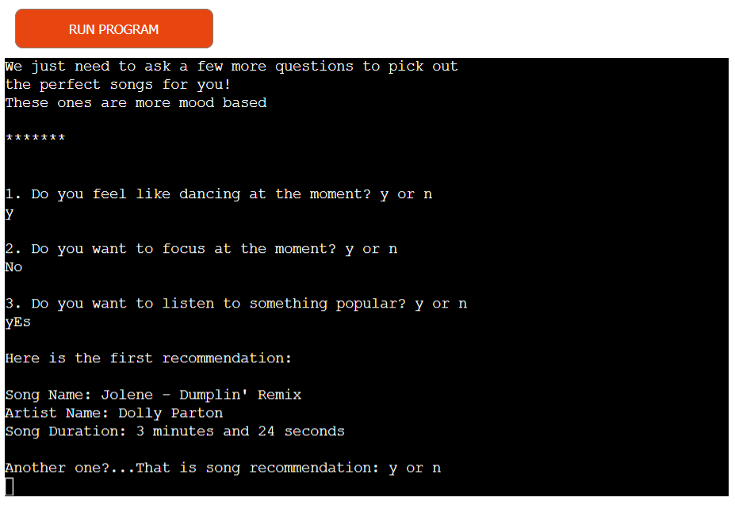

It prints each recommended song one by one, so the user can document the song’s details and if they want another recommendation, they can let the script know to print the next song details on the terminal by answering “y” or “n”.

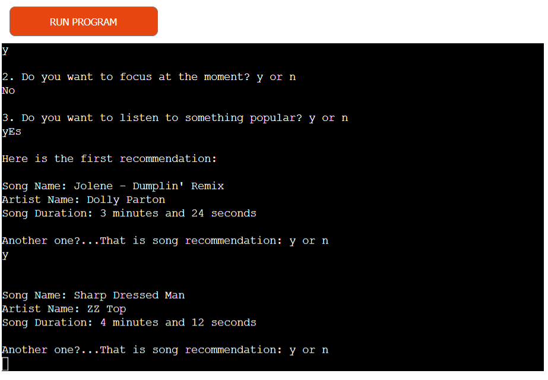
\
&nbsp;

### Play Again
If the user opts not to get another song recommendation, they will be asked if they want to restart the application. If they choose to restart the application, it starts from the very start again and makes brand new recommendations, which are not influenced by the previous recommendations.

If the user does not want to play the game again, they can say “n” and the application will provide a link for the user to access a Google Sheet with all the recommended song details. Due to the sensitivity of pressing ctrl + C, which will cause a `keyboardInterrupt` error in the application, an instruction to highlight the link, right click and select “copy” has been provided. This will allow the user to open a new tab and safely enter the link to the Google sheet.

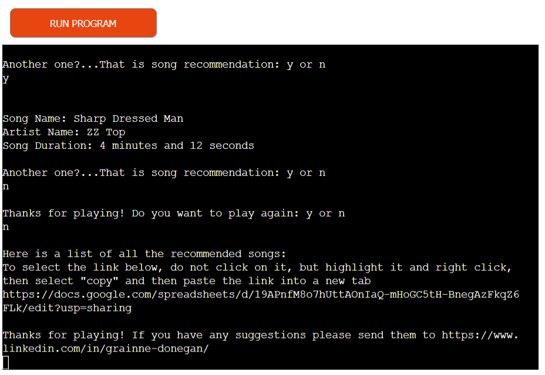

An additional thank you for playing message is included along with a link to the application programmer’s LinkedIn account if the user wanted to reach out to provide feedback.

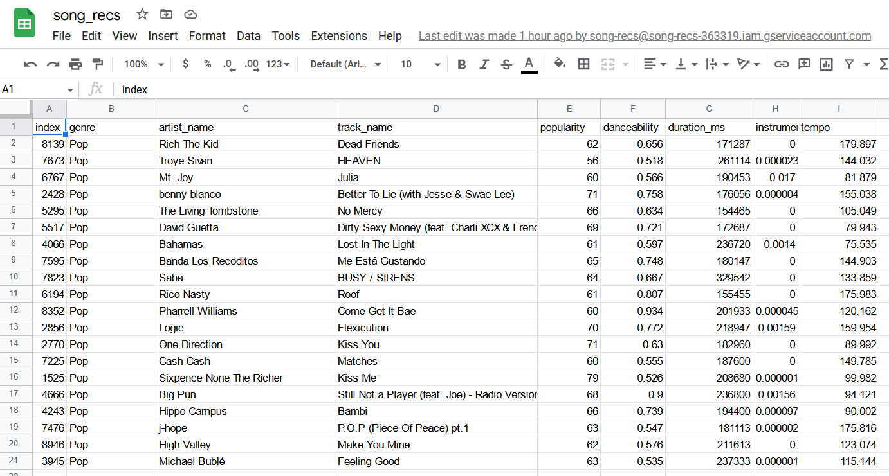
\
&nbsp;

## Features to be Implemented
* Refine the process by storing the song recommendation data and asking the users some questions about themselves, so data analytics can be used to determine what songs are most popular amongst a certain demographic.
* Ask the user if they were happy or not with the recommendation. Could use Machine Learning to produce more effective recommendations.
* Build on the project with the Spotify API, as it has more functions and a greater database of all possible songs on their platform, whereas there’s only just over 200,000 in the dataset used for this application.
\
&nbsp;
[Back to Top](#table-of-contents)
\
&nbsp;

# Technologies Used
## Languages
* [Python]( https://en.wikipedia.org/wiki/Python_(programming_language) "Python")

## Python Libraries and Technologies
* [gspread](https://docs.gspread.org/en/v5.4.0/ "gspread")
* [readline](https://docs.python.org/3/library/readline.html "readline")
* [operator](https://docs.python.org/3/library/operator.html "operator")
* [pandas](https://pandas.pydata.org/ "pandas")
* [string](https://docs.python.org/3/library/string.html "string")
* [Google Drive API]( https://developers.google.com/drive/api/quickstart/python "Google Drive API")

## Tools
* [Gitpod](https://www.gitpod.io/ "Gitpod")
* [GitHub](https://github.com/ "GitHub")
* [PEP8 Linter](http://pep8online.com/ “PEP8 Linter”)
\
&nbsp;
[Back to Top](#table-of-contents)
\
&nbsp;

# Testing

## Code Validation 
### PEP8 Online Linter
The supporting Python document with Spotify class information `spotify.py` was often run through a [PEP8 linter](http://pep8online.com/ "PEP8 Linter") to check for any syntax or declaration errors. Below contains the returned results of the script.

#### First Attempt
Many warning and errors were obtained in the first run through the PEP8 linter. These can be found [here](documentation/pep8_linter). They mainly consisted of lines that were too long, over-indentation or under-indentation of items and then too many or too few blank lines. 

#### Final Attempt
No issues arose in both `spotify.py` and `run.py`

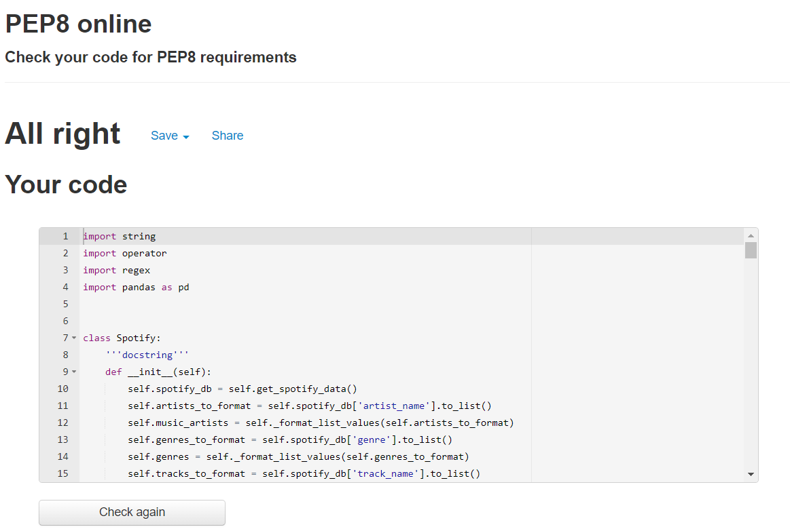
\
&nbsp;
